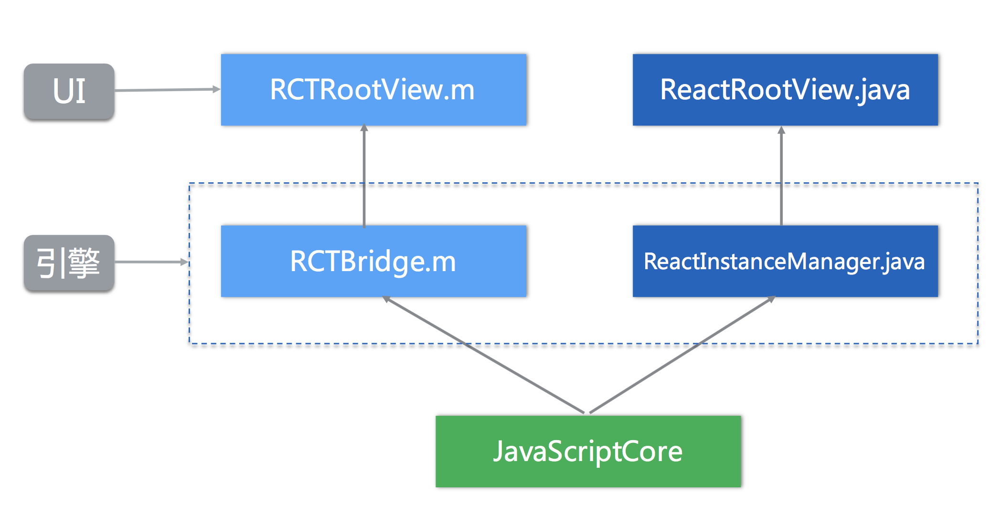

# React Native 技术分享（以下简称RN）

## React Native 优势
1. 跨平台，learn once, write anywhere
2. 代码复用性
    一个编写的好的项目，android和ios代码复用性在85%-95%
3. 开发效率快
4. 支持热更新
5. 较同类框架weex相比，学习成本低，开源库比较多
6. 不需要webview内嵌H5的开发形式，而是通过javaScriptCore调用原生代码，性能更佳

## React Native 缺点
1. 学习成本相对较高
2. 随着业务增长，模块增加，性能会遇到瓶颈，需要对RN资源包进行拆分
3. 最好需要一台Mac电脑

## 开发形式
1. 全项目采用RN开发，复杂度低
    适用于中小型app
2. 原生与RN混编，复杂度高
    适用于规模比较大的项目

## 原理介绍
通过js编写RN界面，使用前端的nodejs的npm工具打包RN开发出来的模块，生成bundle文件，预先存放到原生指定的目录，原生层面在RN引擎初始化时载入并读取bundle并进行渲染

## 项目演示
介绍Demo版的集成RN的伙伴app

## 针对伙伴app如何改造
1. 实现原生与RN混编
2. 界面备份机制
3. 组件编写和扩展
4. 去除重复功能的第三方库，采用RN自带的库，如图片加载

## RN怎样学习（Native视角）
1. 掌握RN生命周期
2. 掌握基于ES6标准的js语法
3. 搞清楚RN组件之间通信机制
4. 阅读核心源码

## RN怎样学习（前端视角）
1. 明白RN与web网页的区别
2. 最好能之前使用过Reactjs或vuejs
3. 搞清楚RN组件之间通信机制
4. 阅读bundle打包运作机制
5. 最好能学习Reat全家桶，如：Redux，Reactjs

## RN发布环节（Android视角）
1. 打bundle包
    react-native bundle --platform android --dev false --entry-file index.android.js --bundle-output android/app/src/main/assets/index.android.bundle --assets-dest android/com/app/src/main/res/
2. 生成安装包
    ./gradlew installRelease
    ./gradlew assembleRelease

## 热更新介绍
1. 早期通过java反射实现
2. 微软的code push支持
3. 搭建私有云服务器实现热更新
4. code-push 操作命令

## 携程对RN进行扩展

## code-push 热更新步骤
1. 安装并执行code-push-server命令
    全局安装路径在/usr/local/lib/node_modules/code-push-server
2. 注册code-push账号，如是私有云服务器则需要安装mysql和导入数据库相关表
3. 登陆账号
    code-push login http://127.0.0.1:3000
4. 添加Android和应用，会生成生产和开发环境的key
    code-push app add Android4RN-android
5. 重新编译bundle并发布bundle
    code-push release-react Android4RN-android android -d Production

## 常用开源项目
- [react-native-blur](https://github.com/react-native-fellowship/react-native-blur)
- [react-native-swiper](https://github.com/leecade/react-native-swiper)
- [react-native-parabolic](https://github.com/stoneWeb/react-native-parabolic)
- [react-native-vector-icons](https://github.com/oblador/react-native-vector-icons)
- [react-native-tab-navigator](https://github.com/exponent/react-native-tab-navigator)
- [react-native-scrollable-tab-view](https://github.com/skv-headless/react-native-scrollable-tab-view)

## 运行
code-push-server

## 第三方组件安装和卸载
1. npm install ...
2. react-native link ...
3. react-native unlink ...

## ===== 以下是旧版本的RN在android上搭建过程 =====

## Android接入RN的混编基础工程，可以直接导入，免去搭建过程中踩坑

## 参考文章：http://www.jianshu.com/p/845cbddeb37a

1. $ npm init
2. $ npm install --save react
3. $ npm install --save react-native
4. $ curl -o .flowconfig https://raw.githubusercontent.com/facebook/react-native/master/.flowconfig
5. $ adb reverse tcp:8081 tcp:8081
6. $ 启动npm start
7. $ Dev Settings设置192.168.50.50:8081
8. $ npm run android-release 生成android热更新包

## 常用命令
1. 查看RN版本号react-native --version
2. 版本更新参考https://facebook.github.io/react-native/docs/upgrading.html
3. 全局安装npm install -g react-native-git-upgrade
4. 安装最新的RN版本react-native-git-upgrade
